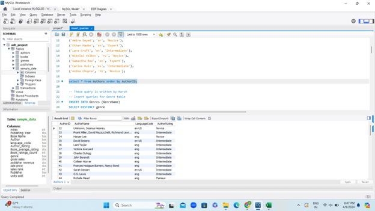
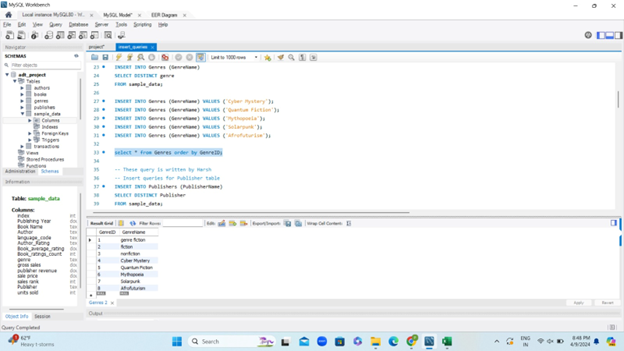
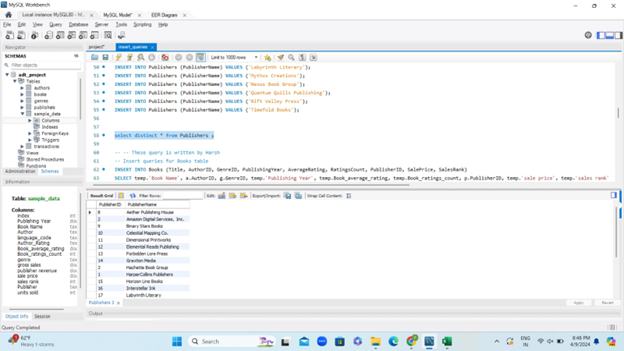
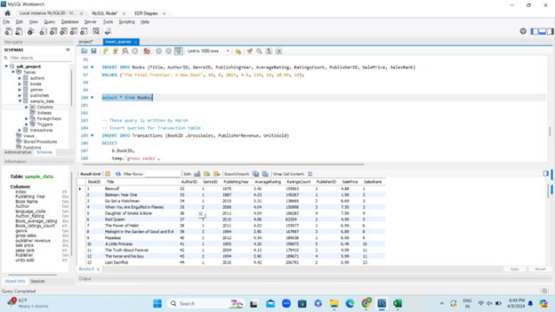
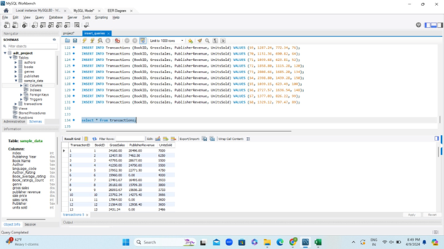

# 📚 SmartLibrary – Library Management System

A modern and user-friendly Library Management System built using Java (or your tech stack). Easily manage books, members, and borrowing history from one central interface.
I is a robust SQL-based backend system for managing virtual book storage with support for authors, genres, publishers, and sales transactions.

> 📁 Project for Advanced Database Technologies, Team: **Data Bandits (Group 6)**

---

## 🚀 Features

- Add, update, and remove books 📖
- Member registration and management 👥
- Book issue and return tracking 🔁
- Search books by title, author, or category 🔍
- Fine calculation for late returns 💰
- Simple UI with clear navigation 🖥️

---

## 🛠️ Tech Stack

- Java / Python / Node.js *(edit as per your project)*
- MySQL / PostgreSQL for database
- Swing / JavaFX / Web front-end
- Git & GitHub for version control

---

## 🛠️ Database Design

### 🧩 Tables Created:
- **Authors**: Stores author details
- **Genres**: Book categories
- **Publishers**: Publishing companies
- **Books**: Book metadata with foreign keys to authors, genres, and publishers
- **Transactions**: Book sales data

### 🔐 Constraints Applied:
- **Primary Keys**: Uniquely identify records
- **Foreign Keys**: Maintain relational integrity
- **Unique Constraints**: Prevent duplicates in name fields
- **Default Values**: `PublisherRevenue` defaults to 0.00
- **NOT NULL**: Enforced for critical fields
- **Data Types**: INT, VARCHAR, DECIMAL used appropriately

---

## 🔄 Entity Relationships

- Books reference **Authors**, **Genres**, and **Publishers**
- **Transactions** are linked to **Books**

> Refer to the included EER diagram under `/assets/eer_diagram.png`

---

## 📸 Screenshots

| Table | Screenshot |
|-------|------------|
| Authors |  |
| Genres |  |
| Publishers |  |
| Books |  |
| Transactions |  |

---

## ⚙️ Project Setup

1. Clone the repo:
   ```bash
   git clone https://github.com/Blank31/VirtualBookStorage.git
   cd VirtualBookStorage

🔗Website Link: https://mjp5.pythonanywhere.com/  (Might not work cause of free subscription.)

YouTube_Link: https://youtu.be/_X-AOarMyaw
